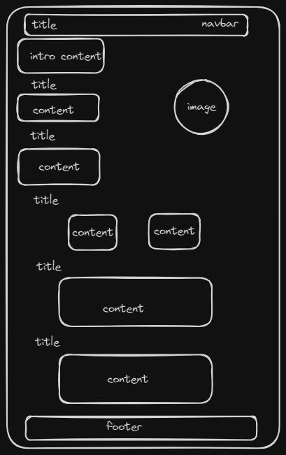

# Design

## Project's design overview

> Give an overview of your project's design

<!-- give an overview of your project's design -->
<!-- describe the reasoning behind your group's design and wireframe -->
<!-- include other centralized decisions like fonts, palates, ... -->

- _text color : #FFFFFF rgb(255 255 255) white_

- _background color :#333333 rgb(51 51 51)_

- _Elements color : rgb(128, 128, 128)_

---

## Wireframe(s)

> Include your wireframe(s) and link to wireframe

- _Home page_

